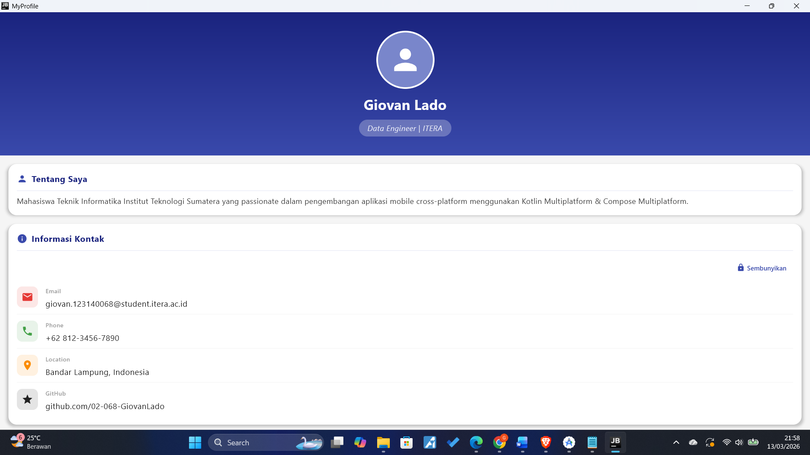
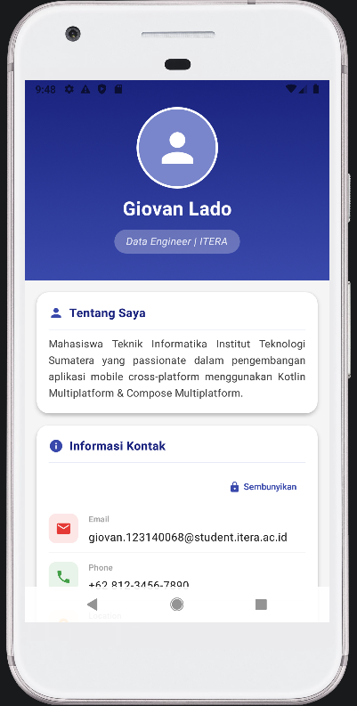

# MyProfile App 📱

Aplikasi profil pribadi berbasis **Kotlin Multiplatform + Compose Multiplatform** yang dapat berjalan di **Android** dan **Desktop (JVM)** dari satu codebase.

> Tugas Praktikum Minggu 3 — IF25-22017 Pengembangan Aplikasi Mobile  
> Institut Teknologi Sumatera

---

## Tampilan Aplikasi

| Bagian | Deskripsi |
|--------|-----------|
| Header | Foto profil circular, nama, dan title |
| Tentang Saya | Bio/deskripsi singkat |
| Informasi Kontak | Email, Phone, Location, GitHub (bisa disembunyikan) |
| Skill & Teknologi | Chip-chip skill yang dimiliki |
| Action Buttons | Tombol Edit Profil & Bagikan |

---

## Struktur Project

```
composeApp/src/commonMain/kotlin/com/example/myprofile/
│
├── App.kt                  ← Entry point utama aplikasi
│
├── model/
│   └── ProfileData.kt      ← Data class profil pengguna
│
├── ui/
│   ├── ProfileHeader.kt    ← Composable 1: Header + avatar circular
│   ├── InfoItem.kt         ← Composable 2: Baris info (icon + label + nilai)
│   ├── ProfileCard.kt      ← Composable 3: Card section generik
│   └── SkillChip.kt        ← Composable 4: Chip skill/teknologi
│
└── theme/
    └── Theme.kt            ← Warna dan konstanta tema aplikasi
```

---

## Composable Functions

### 1. `ProfileHeader`
Menampilkan bagian atas halaman profil dengan avatar berbentuk lingkaran, nama, dan title/jabatan di atas background gradient biru.

```kotlin
ProfileHeader(
    name = "Budi Santoso",
    title = "Mobile Developer | ITERA"
)
```

### 2. `InfoItem`
Satu baris informasi yang terdiri dari icon berwarna, label kecil, dan nilai. Digunakan berulang untuk Email, Phone, Location, dan GitHub.

```kotlin
InfoItem(
    icon = Icons.Filled.Email,
    label = "Email",
    value = "budi@itera.ac.id",
    iconTint = Color.Red
)
```

### 3. `ProfileCard`
Card section generik dengan header (icon + judul) dan slot konten fleksibel menggunakan trailing lambda. Digunakan 3 kali untuk Bio, Kontak, dan Skills.

```kotlin
ProfileCard(title = "Tentang Saya", icon = Icons.Filled.Person) {
    Text("isi konten bebas di sini")
}
```

### 4. `SkillChip`
Chip berbentuk pill kecil untuk menampilkan satu skill atau teknologi. Digunakan berulang dalam grid skills.

```kotlin
SkillChip(skill = "Kotlin")
```

---

## Komponen UI yang Digunakan

`Column` · `Row` · `Box` · `Card` · `Text` · `Button` · `OutlinedButton` · `Icon` · `HorizontalDivider` · `Modifier`

---

## Fitur Tambahan (Bonus)

- **AnimatedVisibility** — section Informasi Kontak dapat disembunyikan/ditampilkan dengan animasi `fadeIn + slideInVertically`
- **AppColors object** — semua warna terpusat di `Theme.kt` agar mudah diubah

---

## Cara Build & Menjalankan

### Android
Buka project di Android Studio, pilih konfigurasi `composeApp`, lalu klik **Run**.

Atau lewat terminal:
```bash
./gradlew :composeApp:assembleDebug
```

### Desktop
```bash
./gradlew :composeApp:run
```

---

## Screenshot

### 🖥️ Desktop



### 📱 Android



---

## Dependencies Utama

```toml
# gradle/libs.versions.toml
compose-multiplatform = "1.7.x"
```

```kotlin
// composeApp/build.gradle.kts
commonMain.dependencies {
    implementation(compose.material3)
    implementation(compose.materialIconsExtended)
    implementation(compose.foundation)
}
```

---

## Informasi Pengumpulan

- **Repository:** push ke GitHub repository yang sama dengan tugas sebelumnya
- **README:** sertakan screenshot aplikasi di Android/Desktop
- **Deadline:** Sebelum Pertemuan 4
- **Bobot:** 4%
